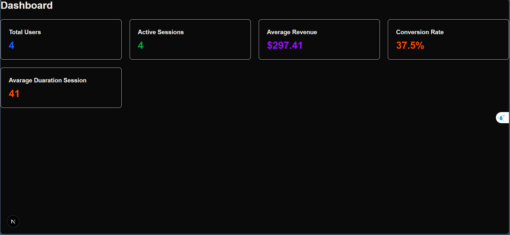

# Dashboard Metrics Testing Report

## 1. Chiến lược mở rộng Mock Data

- Sử dụng các hàm helper `makeSession()` và `makeConversion()` để tạo dữ liệu mẫu.
- Áp dụng **override** để sinh các biến thể khác nhau: session không hợp lệ, conversion có giá trị `NaN`, session inactive,...
- Tạo tập dữ liệu lớn (10.000 session, 3 conversion) để stress test performance và logic tính toán.
- Mục đích: kiểm tra tính chính xác và ổn định của `summarizeDashboardMetrics()` trên nhiều tình huống.

**Insight thu được:**

- Dữ liệu mock giúp phát hiện các edge case và bug trong tính toán metrics.
- Việc lọc dữ liệu invalid là quan trọng để kết quả thống kê không bị lệch.

---

## 2. Danh sách Test Case và Kết quả

1. empty datasets (1): returns all zeros when no sessions and no conversions
2. normal datasets (1): calculates correct basic metrics
3. invalid dataset (broken elements) (1): skips invalid sessions and conversions
4. extreme values (1): handles large numbers and high volume datasets correctly

---

## 3. Nhận xét cá nhân

**Khó khăn:**: `averageRevenue` và `conversionRate` dễ bị lệch nếu không loại bỏ các giá trị invalid.

**Cách khắc phục:**

- Kiểm tra và chuẩn hóa dữ liệu input trước khi tính toán.
- Sửa logic trong `summarizeDashboardMetrics()` để bỏ qua session/conversion không hợp lệ.

**Đề xuất cải tiến tiếp theo:**: Mở rộng test case cho các tình huống edge case khác: session trùng lặp, revenue âm

